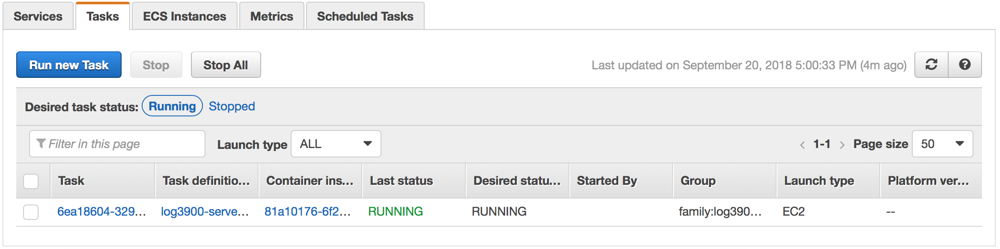

# PolyPaintPro
|               | Master        | Develop |
| ------------- |:-------------:| :-----:|
| CI Status     | [](https://circleci.com/gh/EricLiCA/log3900-04) | [](https://circleci.com/gh/EricLiCA/log3900-04/tree/develop) |
| Code coverage      | N/A      |   N/A |
| Deployed server | http://ec2-18-214-40-211.compute-1.amazonaws.com/      |    N/A |
| iOS | [](https://shields.io/)      |   [](https://shields.io/) |
| Windows | [](https://shields.io/)      |    [](https://shields.io/) |

## Target devices
| iOS         | Windows                |
| :---------: | :--------------------: |
| iPad Mini 4 | Any PC with Windows 10 |

# Description

PolyPaint is the third year Bachelor's of Engineering (Software Engineering) project at Polytechnique Montréal done during the Fall semester of 2018. The goal of the project is to build a multi-platform application that enables users to collaboratively create, edit, and save images via a desktop client for Windows 10, an iPad application, and a website.

# Getting Started

## Quick start

### iOS Client

Clone the project

```Bash
git clone https://github.com/EricLiCA/log3900-04.git
```

Navigate to iOS directory

```Bash
cd poly-paint-ios
```

Install CocoaPods if you don't already have it

```Bash
sudo gem install cocoapods
```

Get all dependencies with CocoaPods

```Bash
pod install
```

Open project in XCode:

[](https://shields.io/)

```Bash
open poly-paint-ios.xcworkspace/
```

Select iPad Pro (9.7 inch) as target, and click the play button to run the simulator.


# Contributing

## Git

### Setup

We use GitHub as the main remote git server for development, taking advantage of the pull request UI. We use the school's git server to submit our work for grading.

To set this up, clone the repository offered by the school:

```Bash
git clone https://githost.gi.polymtl.ca/git/log3900-04
```

Then go into the cloned directory:

```Bash
cd log3990-04/
```

Then add GitHub as a remote repository:

```Bash
git remote add github https://github.com/EricLiCA/log3900-04.git
```

You now have the option to push to `origin` or `github`:

```Bash
git push origin
```

```Bash
git push github
```

### Workflow

We use the branch system. We have:

- a master branch that is always production ready.
- a development branch that contains the latest merged features.
- release branches to support the preparation of a new release.
- feature branches that contain features that are still in progress.
- hotfix branches

We identify which features we want included in the next release. Those features are developed in `feature branches`, which are then merged into `develop`. Once all the features we've identified for the next release are merged into `develop`, we create a new `release branch` from the `develop branch`.

If you're working on a feature that isn't included in the current release, don't merge it into the `develop branch`; keep pulling from `develop` into your `feature branch`.

The `release branch` is for working on small bug-fixes or other minor changes to prepare the application to be production ready.

Once the `release branch` is production ready, we merge it into the `master branch`, and tag it with a version number. We also merge the `release branch` into the `develop branch` so that future versions contain the bug fixes and minor changes.

The `hotfix branches` branch off `master`, and are for fixing critical bugs found in production. Once the hotfix is finished, it is merged into the `master` and `develop` branches.

### Merging

We use GitHub's pull request system to merge a branch.

# Deployment

## Server

To deploy on AWS, make sure the awscli is configured, then run the following commands:

```
cd server
$(aws ecr get-login --no-include-email --region us-east-1)
docker build -t log3900-server .
docker tag log3900-server:latest 042607413139.dkr.ecr.us-east-1.amazonaws.com/log3900-server:latest
docker push 042607413139.dkr.ecr.us-east-1.amazonaws.com/log3900-server:latest
```

Then navigate to AWS ECS -> Clusters -> <cluster-to-deploy-on> -> Tasks and stop the previous task, and start a new one with the latest image


