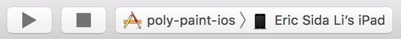

PolyPaintPro is a multi-platform application that enables users to collaboratively create, edit, and save images via a desktop client for Windows 10, an iPad application, and a web browser.

----

|               | Master        | Develop |
| ------------- |:-------------:| :-----:|
| CI Status     | [](https://circleci.com/gh/EricLiCA/log3900-04) | [](https://circleci.com/gh/EricLiCA/log3900-04/tree/develop) |
| Code coverage      | N/A      |   N/A |
| Deployed server | http://ec2-18-214-40-211.compute-1.amazonaws.com/      |    N/A |
| iOS |       |    |
| Windows |       |     |

## Target Devices
| iOS         | Windows                |
|:-----------:|:----------------------:|
| iPad Mini 4 | Any PC with Windows 10 |


## Technology Stack
| | |
| :-------------------- | :--|
|  Swift | |
|  C# | |
|  Angular | |
|  NodeJS | |
|  PostgreSQL | |
|  Redis | |
|  Docker | |
|  Amazon Web Services

----

# Getting Started

## Quick Start

### iOS Client

Requires XCode:

[](https://shields.io/)

```Bash
git clone https://github.com/EricLiCA/log3900-04.git
cd log3900-04/poly-paint-ios # iOS directory
sudo gem install cocoapods # if you already have cocoapods skip
pod install # install dependencies
open poly-paint-ios.xcworkspace/ # opens project in XCode
```

#### Simulator
Select iPad Pro (9.7 inch) as target, and click the play button to run the simulator.


#### iPad Mini 4
Select your iPad as target (e.g. Eric Sida Li's iPad), and click the play button to install the app on the device.



If this is the first time running the app, you will have to grant it permissions on the iPad. Go to General -> Device Management:


Tap on your developer account:


Verify the app:


### Windows Client

Requires Visual Studio ([install here](https://visualstudio.microsoft.com/)):


```Bash
git clone https://github.com/EricLiCA/log3900-04.git
cd log3900-04/windows-client # windows client directory
start PolyPaint.sln # open project in Visual Studio
```

Click the play button to run the app.


# Contributing

## Git

### Setup

We use GitHub as the main remote git server for development, taking advantage of the pull request UI. We use the school's git server to submit our work for grading.

To set this up:

```Bash
git clone https://githost.gi.polymtl.ca/git/log3900-04
cd log3990-04/ # go into cloned repository
git remote add github https://github.com/EricLiCA/log3900-04.git # add GitHub as a remote repository
git push origin # you now have the option to push to origin or github
git push github
```

### Workflow

We use the branch system. We have:

- a master branch that is always production ready.
- a development branch that contains the latest merged features.
- release branches to support the preparation of a new release.
- feature branches that contain features that are still in progress.
- hotfix branches

We identify which features we want included in the next release. Those features are developed in `feature branches`, which are then merged into `develop`. Once all the features we've identified for the next release are merged into `develop`, we create a new `release branch` from the `develop branch`.

If you're working on a feature that isn't included in the current release, don't merge it into the `develop branch`; keep pulling from `develop` into your `feature branch`.

The `release branch` is for working on small bug-fixes or other minor changes to prepare the application to be production ready.

Once the `release branch` is production ready, we merge it into the `master branch`, and tag it with a version number. We also merge the `release branch` into the `develop branch` so that future versions contain the bug fixes and minor changes.

The `hotfix branches` branch off `master`, and are for fixing critical bugs found in production. Once the hotfix is finished, it is merged into the `master` and `develop` branches.

### Merging

We use GitHub's pull request system to merge a branch.

## Server

### Database Environment Variables

Set the following environment variables for access to the databases:

#### PostgreSQL
```Bash
PG_HOST # localhost
PG_PORT # 5432
PG_USER
PG_PASSWORD
PG_DB
```

## Databases

### PostgreSQL

Update the DDL file `databases/postgresql/postgres-ddl.sql` when you want to change the database schema. In DataGrip, you can edit your columns, and then generate the DDL files by right-clicking on `tables`, then selecting `SQL Scripts` -> `Generate DDL to Console`, and then copy-paste it in the DDL file in the repository, and commit your changes.


### Redis

Make sure a Redis instance is running on `localhost:6739` when developing. To get one running quickly:

#### macOS
```Bash
brew install redis
redis-server # once the installation is done
```

# Deployment

## Server

To deploy on AWS, make sure the awscli is configured, then run the Makefile command:

```
make deploy
```

Then go to `(AWS Elastic Container Service)/Clusters/<cluster-to-deploy-on>/Tasks` on your browser and stop the previous task. Then start a new one with the latest Docker image.


